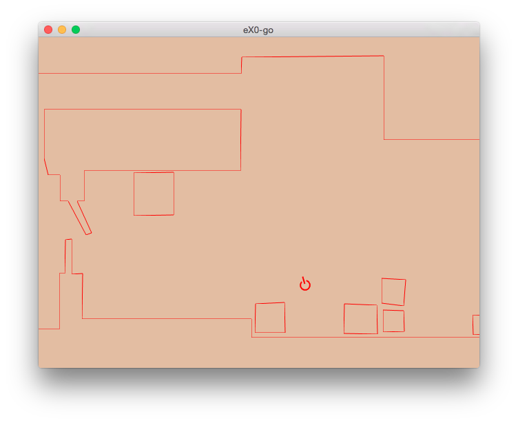

# eX0-go [](https://travis-ci.org/shurcooL/eX0)

eX0-go is a work in progress Go implementation of eX0.

The client runs as a native desktop app and in browser.

Installation
------------

You'll need to have OpenGL headers (see [here](https://github.com/go-gl/glfw#installation)).

```bash
go get -u github.com/shurcooL/eX0/eX0-go

# Get additional dependencies for tcp and js build tags.
go get -u -d -tags="tcp" github.com/shurcooL/eX0/eX0-go
go get -u -d -tags="tcp js" github.com/shurcooL/eX0/eX0-go
```

Use this folder as the current working directory when running `eX0-go` binary.

Screenshot
----------

The port is incomplete; this screenshot represents the current state.



Browser
-------

The client can run in browser by leveraging [GopherJS](https://github.com/gopherjs/gopherjs#readme) for Go to JavaScript compilation, WebGL for graphics, WebSocket for networking. Only the `-tags=tcp` networking mode is supported, so you'll need to run the server with that build tag:

```bash
go build -tags=tcp -o /tmp/eX0-go
/tmp/eX0-go server-view # Or server for dedicated server.
```

To compile Go to JavaScript, you'll need [GopherJS compiler](https://github.com/gopherjs/gopherjs#installation-and-usage). Install it with `go get -u github.com/gopherjs/gopherjs` and run:

```bash
gopherjs serve --tags=tcp
```

Then open <http://localhost:8080/github.com/shurcooL/eX0/eX0-go> to start up the client.

By default, it will use client-view mode and connect to an eX0-go server at "localhost". You can specify flags via query parameters. E.g., to connect to "example.com" with a player name of "shaGuar", use <http://localhost:8080/github.com/shurcooL/eX0/eX0-go?-host=example.com&-name=shaGuar&client-view>.

License
-------

- [MIT License](http://opensource.org/licenses/mit-license.php)
